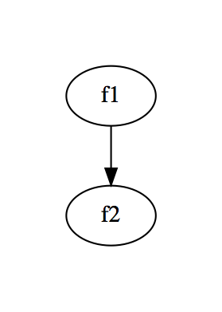
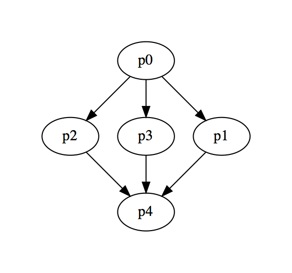
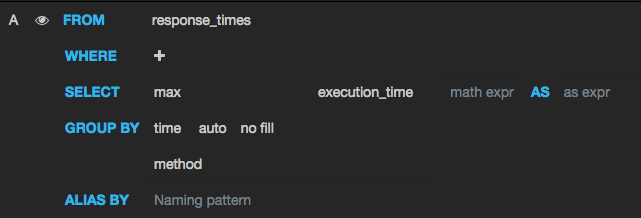
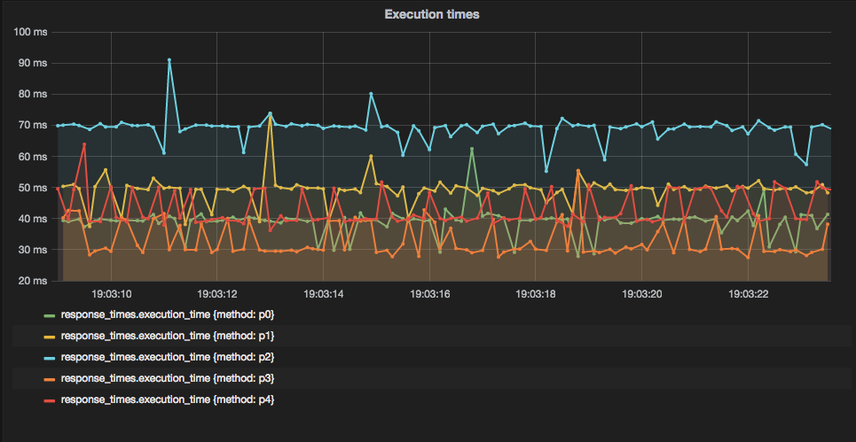

# Précepte

## Overview

Précepte is a pure functional library that provides context and insight on your code execution.

It can be used to have [contextualized logs](#contextualized-logs), [collect high quality metrics](#monitoring-with-influxdb-and-grafana), [generate a graph representing you program execution](#graph-it), etc.

A Précepte is basically just free monad and a state monad.

## Table of Content

TODO: add link to doc in readme

## Prerequisites

Using Précepte is not different from using a `Future` or any other monadic data type.
You should understand the concepts of `Monad`, `Functor` and `Applicative`, and be familiar with [Scalaz](https://github.com/scalaz/scalaz) or [Cats](https://github.com/non/cats). All the examples below are using Scalaz, but Précepte is also fully compatible with Cats

## Using Précepte in your project

Just add the following dependency in your `built.sbt`

```scala
libraryDependencies += "com.mfglabs" %% "precepte-core" % precepteVersion
```

You may also want the modules providing support for Logback, Influxdb, and Play framework:

```scala
libraryDependencies += "com.mfglabs" %% "precepte-logback" % precepteVersion

libraryDependencies += "com.mfglabs" %% "precepte-influx" % precepteVersion

libraryDependencies += "com.mfglabs" %% "precepte-play" % precepteVersion
```


## From Future to Précepte

A Précepte is always parameterized by a type `F` representing the effect.
This documentation is using `Future`, since it's familiar to most Scala developers.

Let's say you've written the following code:

```tut:invisible
import scala.language._
```

```tut:silent
import scala.concurrent.Future
import scala.concurrent.ExecutionContext.Implicits.global

def f1: Future[Int] = Future.successful(42)
def f2(s: Int): Future[String] = Future.successful(s"The answer to life the universe and everything is $s")
```

If you were to "chain" the calls to `f1` and `f2`, that is call `f1` and feed it's return to `f2`, you'd be writing something like:

```tut:silent
val ultimateAnswer: Future[String] =
  for {
    s <- f1
    i <- f2(s)
  } yield i
```

Let's define a simple await function to test our code:

```tut:silent
import scala.concurrent.Await
import scala.concurrent.duration._
def await[A](f: Future[A]) = Await.result(f, 10 seconds)
```

Now we can test it:

```tut
await(ultimateAnswer)
```


All is well, but you'd really like to be able to collect insights on your code, like how fast it is. Of course you choose to use Précepte for that!

Let's rewrite you code to use Précepte, and attach some metadata to it.

```tut:silent
import scala.concurrent.Future
import scala.concurrent.ExecutionContext.Implicits.global

import com.mfglabs.precepte._
import corescalaz._
import default._

type Pre[A] = DPre[Future, Unit, A]
object Demo extends Category("demo") {
  def apply[A](f: ST[Unit] => Future[A])(implicit c: Callee) =
    Pre(BaseTags(c, Demo))(f)
}

import Macros.callee

def f1: Pre[Int] =
  Demo { st =>
    Future.successful(42)
  }

def f2(s: Int): Pre[String] =
  Demo { st =>
    Future.successful(s"The answer to life the universe and everything is $s")
  }
```

What we've done so far is not particularly exiting. We wrapped everything in a Précepte, and added metadata: the name of the current method, and their "categories". A category is just a group or layer of things in your code. It could be "Database" for all the methods accessing a Database, or "WS" for the methods calling a webservice, or anything you like.

One interesting point is that, at call site, apart from the return type, everything stays identical to our old `Future` version (pun totally intended).

```tut:silent
val ultimateAnswerPre: Pre[String] =
  for {
    s <- f1
    i <- f2(s)
  } yield i
```

### The state

You probably have noticed a little `st` parameter sneaked into our code. This `st` is the current state. By default, Précepte will add the interesting metadata it collected in that state (Category, function name, ...). You can also use Précepte to carry a "custom" state.
The type of the custom state is fixed in our type definition for Pre. We said it was Unit (remember: `type Pre[A] = DPre[Future, Unit, A]`).

Now if we want to run our code, we need to provide an initial state. Précepte will also ask you to provide information about the environment in which our application is executing.

```tut:silent
val env = BaseEnv(Host("localhost"), Environment.Dev, Version("1.0-DEMO"))
val nostate = ST(Span.gen, env, Vector.empty, ())

implicit val unitSG = new scalaz.Semigroup[Unit] {
  def append(f1: Unit, f2: => Unit) = ()
}

import scalaz.std.scalaFuture._
```

// TODO: explain semigroup

Ok so we've added a bit of code, and finally, we're able to test the execution:

```tut
val eventuallyUltimateAnswer = ultimateAnswerPre.eval(nostate)
await(eventuallyUltimateAnswer)
```

// TODO: Précepte and the State Monad

### Error handling

TODO

## Contextualized logs

Now that you have access to metadata about the executing code, you can do pretty interesting things, like collecting contextualized logs.
Précepte has a module to support [Logback](http://logback.qos.ch/). all you have to to is add it into your `build.sbt` file.

```scala
libraryDependencies += "com.mfglabs" %% "precepte-logback" % precepteVersion
```

Once you have that, you can start using you contextualized Logger :)

```tut:silent
val logback = Logback(env, "demo-logger")

object WithLogger extends Category("demo") {
  def apply[A](f: logback.Logger => Future[A])(implicit c: Callee) = {
    val withLogger = (st: ST[Unit]) => f(logback.Logger(st.managed.span, st.managed.path))
    Pre(BaseTags(c, Demo))(withLogger)
  }
}

import Macros.callee

def f1: Pre[Int] =
  WithLogger { logger =>
    logger.info("Computing a value")
    Future.successful(42)
  }

def f2(s: Int): Pre[String] =
  WithLogger { logger =>
    println("prout")
    logger.info("Performing string concatenation!", Macros.param(s))
    Future.successful(s"The answer to life the universe and everything is $s")
  }

val ultimateAnswerPre: Pre[String] =
  for {
    s <- f1
    i <- f2(s)
  } yield i
```

And now when we run the code:

```tut:silent
val ultimateAnswer = ultimateAnswerPre.eval(nostate)
await(ultimateAnswer)
```

Assuming logback is configured properly (see [the example logback.xml](../precepte-tut/src/main/resources/logback.xml)), the following should appear in your console:

```json
{
  "@timestamp": "2015-11-13T16:29:47.656+01:00",
  "@version": 1,
  "message": "Computing a value",
  "logger_name": "application",
  "thread_name": "run-main-11",
  "level": "INFO",
  "level_value": 20000,
  "HOSTNAME": "Juliens-MacBook-Pro.local",
  "span": "c8e9b61b-cf7c-4272-85da-7c320effb037",
  "callees": "/f1",
  "path": "/3_0",
  "environment": "dev",
  "parameters": {}
}
{
  "@timestamp": "2015-11-13T16:29:47.717+01:00",
  "@version": 1,
  "message": "Performing string concatenation!",
  "logger_name": "application",
  "thread_name": "ForkJoinPool-1-worker-13",
  "level": "INFO",
  "level_value": 20000,
  "HOSTNAME": "Juliens-MacBook-Pro.local",
  "span": "c8e9b61b-cf7c-4272-85da-7c320effb037",
  "callees": "/f1/f2",
  "path": "/3_0/4_0",
  "environment": "dev",
  "parameters": {
    "s": "42"
  }
}
```

## Graph it!

Précepte basically turn your code into a algebra, and an interpreter.
It's very easy to change the runtime a bit in order to alter the semantics of a program.
One application of this simple but powerful idea is built-in into Précepte.
You can very easily generate an execution graph of your program:

```tut:silent
  val ultimateAnswerWithExecutionGraph = ultimateAnswerPre.graph(Graph.empty).eval(nostate)
  val (graph, result) = await(ultimateAnswerWithExecutionGraph)
```

The graph can then easily be turned into a graphviz representation:

```tut
graph.viz
```

Which once rendered looks like this:



And indeed in our code, we call f1 and then f2. Let's try this with a slightly more complex example.
Let's start by defining a bunch of async computations:

```tut:silent
def p0 = Demo(s => Future(0 -> 0))
def p1 = Demo(s => Future(1 -> 1))
def p2 = Demo(s => Future(2 -> 2))
def p3 = Demo(s => Future(3 -> 3))
def p4 = Demo(s => Future(4 -> 4))
```

We can now built a more realistic example than the previous, mixing sequential and parallel effects using monads and applicative functors:

```tut:silent
import scalaz.syntax.applicative._
val ptest =
  for {
    _ <- p0
    _ <- (p1 |@| p2 |@| p3).tupled
    _ <- p4
  } yield ()
  val (demoGraph, _) = await(ptest.graph(Graph.empty).eval(nostate))
```

```tut
demoGraph.viz
```

And again rendering this nice little graph :)




## Monitoring with InfluxDB and Grafana

So far we've used Précepte to generate fancy logs, and visualize the execution of our program as a graph.
The last use case we're going to show is the addition of monitoring to an application developed with Précepte.

For this feature to work, you'll need to add the influxdb module in you project dependencies:

```scala
libraryDependencies += "com.mfglabs" %% "precepte-influx" % precepteVersion
```

For the sake of demo, we'll use effect with random execution times:

```tut:silent
import scala.concurrent.duration._
import akka.actor.ActorSystem;
val system = ActorSystem.create("demo-system")

def rnd(d: FiniteDuration)(v: (Int, Int)) = {
  val rnd = scala.util.Random
  val salt = rnd.nextInt(10).milliseconds
  akka.pattern.after(d + salt, system.scheduler)(Future.successful(v))
}

def p0 = Demo(s => rnd(10 milliseconds)(0 -> 0))
def p1 = Demo(s => rnd(20 milliseconds)(1 -> 1))
def p2 = Demo(s => rnd(40 milliseconds)(2 -> 2))
def p3 = Demo(s => rnd(5 milliseconds)(3 -> 3))
def p4 = Demo(s => rnd(15 milliseconds)(4 -> 4))

import scalaz.syntax.applicative._
val demo =
  for {
    _ <- p0
    _ <- (p1 |@| p2 |@| p3).tupled
    _ <- p4
  } yield ()
```

Now we have created the program but we've not executed it yet.
All we have to do to push metrics into an [influxdb](https://influxdb.com/) instance is configure the influx client, and "inject" it into the execution of our program.

```scala
val influx = Influx[Unit](
    new java.net.URL("http://localhost:8086"),
      "root",
      "root",
      "precepte_demo"
    )
val monitoredDemo = demo.mapSuspension(influx.monitor)
```

now if we execute the code, metrics are automatically pushed to Influxdb.

```scala
val result =
  for {
    _ <- 1 to 100
  } await(monitoredDemo.eval(nostate))
```


Using [Grafana](http://grafana.org/) and the following query:



We can get a very nice graph of our functions execution times.




TODO: list all the available tags

## Using Précepte with Play Framework.

TODO

## Précepte and the Free monad.
